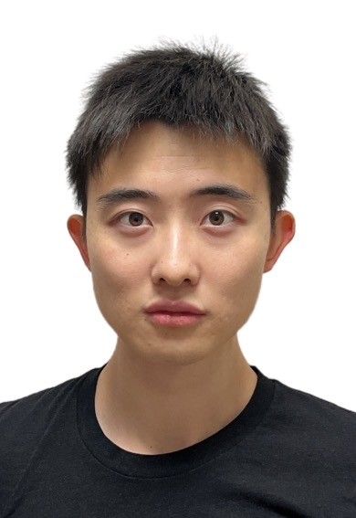

</> HTML

Hi! My name is Eric Zhang. I am a graduate student at <a href="https://www.washington.edu/" target="_blank">University of Washington</a>. My advisor is Prof. <a href="https://sites.math.washington.edu/~zhang/" target="_blank">James Zhang</a>.

I work in noncommutative algebra and homological algebra, with a focus on simplicial algebras. In particular, I study how simplicial structure interacts with classical algebraic notions such as simplicity, separability, and Morita equivalence.  

Email: zhangj20@uw.edu

Office: Padelford Hall C-38.
